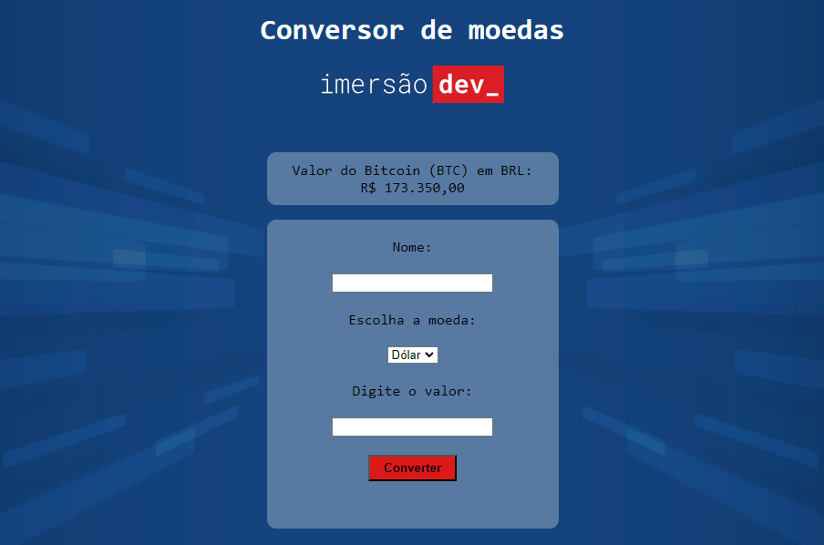

<h1 align="center"> LINKS </h1>

Projeto feito como desafio da Imersão Alura.

  <a href="#-tecnologias">Tecnologias</a>&nbsp;&nbsp;&nbsp;|&nbsp;&nbsp;&nbsp;
  <a href="#-projeto">Projeto</a>&nbsp;&nbsp;&nbsp;|&nbsp;&nbsp;&nbsp;
  <a href="#memo-licença">Licença</a>

  

 

  

## 🚀 Tecnologias

Esse projeto foi desenvolvido com as seguintes tecnologias:

- HTML e CSS
- JavaScript
- Git e Github

## 💻 Projeto

O conversos de moedas é uma ótima ferramenta para você que compra online em sites extrangeitros, ou que está viajando, os valores estão sempre atualizados.

## :memo: Licença

Esse projeto está sob a licença MIT.